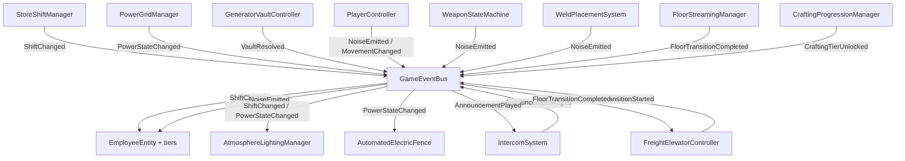

# INFINITE WALMART — Core Systems Architecture

3D SCP-style survival horror in an infinitely deep, procedurally generated superstore.
This document is the structural map. Scripts live under `Assets/Scripts/` in Unity-flavored
C# (MonoBehaviour/ScriptableObject); all patterns port directly to Godot C#.

**Division of labor:** this layer defines system structure, state machines, event contracts,
and data slots. Every `TODO(Opus)` marker is a delegated implementation site — math formulas,
tuning curves, VFX/SFX wiring, and polish.

---

## The Spine: GameEventBus

No system references another system directly. Everything communicates through
`Core/GameEventBus.cs` — publish about yourself, subscribe about others.

## The Stealth Contract (the load-bearing design loop)

1. `PlayerController` movement states carry **noise multipliers**
   (Run ×2.2, Walk ×1.0, Crouch ×0.25, Idle 0) and set **visibility**
   (Exposed / Lowered / Hidden) on `PlayerVisibilityProfile`.
2. Everything audible — footsteps, gunshots, crowbar breaches, welding arcs,
   barricade impacts — broadcasts a `NoiseEvent{origin, radius, loudness, tag}`.
3. Employee tiers consume these asymmetrically:

| Tier | Senses | Counter-play |
|---|---|---|
| **Stocker** | Blind; supernatural hearing | Crouch (¼ noise radius) |
| **Rollback Roller** | Vision cone; fast straights, bad corners | Break line of sight; corners |
| **Greeter** | Vision → converts sightings into max-loudness screech `NoiseEvent` | Kill quietly (silenced vault rifle) |
| **Night Shift Manager** | All senses; broadcasts own footsteps back at the player | Track it by ear; survive to morning |

## System Modules

| # | Module | Key scripts | Core state machine |
|---|---|---|---|
| 1 | Shift & Employees | `Environment/StoreShiftManager`, `Environment/IntercomSystem`, `AI/*` | `MorningShift ⇄ NightShift`; `PassiveWander → Investigating → Hunting → AttackingBarricade → Stunned` |
| 2 | Player & Looting | `Player/*` | `Idle/Walking/Running/Crouching`; hold-E progress with 3 cancellation fail-safes (key release, target lost, damage taken) |
| 3 | Power & Vault | `Power/*` | `PoweredOn ⇄ Blackout`; one-shot race: player repair vs. background AI countdown → `PlayerUnlocked` / `PermanentlyLocked`, forever |
| 4 | Industrial Crafting | `Crafting/*` | Pressure Machine + 10× Common Wires → converter node → activate → permanent `Industrial` tier (fences, NVG, riot armor) |
| 5 | Scrap Weapons | `Weapons/*` | `Idle → Firing → ManualReloading` (interruptible step loop); Pipe Shotgun: 10 pellets × 12dmg, 18° spread, 6m falloff, 5s reload, unsilenceable 45m gunshot |
| 6 | Freight Elevators | `Elevator/*` | `IdleOpen → Sealing → InTransit → Arriving`; cabin is the loading screen; deterministic `(worldSeed, floorIndex) → layout` |
| 7 | Welding & Barricades | `Building/*` | `Target → Carry (free 3D rotate) → Weld`; durability pools by archetype (rack 40 / case 90 / gondola 220); AI attacks are audible |
| 8 | Atmosphere | `Rendering/*` | Mood = Shift × Power → `OpenBright / ClosedDim / BlackoutDark`; deterministic 30% night-light lottery; distance-swapped pure-black shadow models |

## Cross-System Design Locks (do not break these)

- **The intercom leads the horror.** Shift flips 4s *after* the announcement starts.
- **The vault is the industrial on-ramp.** Its registry (3× High-Grade Battery, 10× Common
  Wires, 1× Pressure Machine, pre-modded rifle with Silencer|DrumMag|Flashlight|ExtraGrip)
  contains exactly one converter recipe. Lose the race, and the industrial tier must be
  scavenged the hard way.
- **Every convenience makes noise.** Welding, breaching, crafting hums, shotgun reloads —
  power costs presence on the noise bus, always.
- **Blackouts kill fences.** Traps are grid-powered; defenses fail at the worst time unless
  a battery backup is installed.
- **Determinism = persistence.** Floor layouts and night-light patterns are seed-hashed,
  never saved. Revisits look identical for free.
- **Shadow models are aesthetic AND optimization.** Distance culling produces silhouettes;
  the performance trick is the scare.
